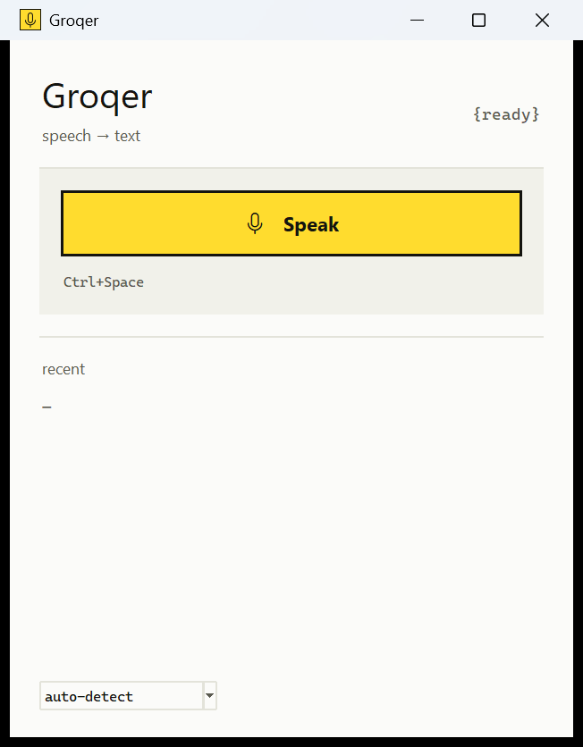

# Groqer

Push-to-talk dictation for Windows. Hold nothing, press **Ctrl+Space**, speak,
press it again — the text lands in whatever window you were typing in.
Transcription runs on Groq's `whisper-large-v3`, which is free for personal use
and handles Russian as well as it handles English.



## Why this exists

Polished dictation apps for Windows either run the model locally — which is slow
on a laptop without a discrete GPU — or charge a subscription for a hosted one.
Groqer is ~700 lines of Python that sit between your microphone and an API key
you already have. Audio goes to `api.groq.com` and nowhere else; nothing is
stored on disk.

## Install

Requires Windows 10/11 and Python 3.11+.

```bash
python -m venv .venv
.venv\Scripts\python.exe -m pip install -r requirements.txt
.venv\Scripts\pythonw.exe voice_typing.py
```

Use `pythonw.exe` rather than `python.exe` so no console window appears. Make a
desktop shortcut to that command and point its icon at `groqer.ico`.

## The API key

Groqer looks for the key in this order:

1. the `GROQ_API_KEY` environment variable
2. `groq.env` next to the script, as `GROQ_API_KEY=gsk_...`

If it finds neither, the window shows a field — paste the key, press **ok**, and
it is written to `groq.env` for you. Get a free key at
[console.groq.com/keys](https://console.groq.com/keys).

The free tier gives 20 requests per minute, 2000 per day and 7200 seconds of
audio per hour. Dictation does not come close to that.

## Using it

**Ctrl+Space** starts and stops recording; the **Speak** button does the same.
While recording, a small translucent microphone follows the mouse cursor and
breathes slowly, so you can tell you are live without looking away.

The transcript always goes to the clipboard. If another window is focused it is
also pasted there; if Groqer's own window is in front there is nothing to paste
into, so the status says `copied` instead of `pasted`.

The last five transcripts stay in the window — click any of them to copy it
again.

The language dropdown carries every language `whisper-large-v3` supports, with
auto-detect and the two you use most pinned to the top. Note that picking the
*wrong* language does not degrade gracefully: tell Whisper "English" while
speaking Russian and it will translate rather than transcribe.

## How it works

Audio is captured at 16 kHz mono and encoded as FLAC in memory — lossless and
about 10 KB per second, so uploads are quick. The recording never touches disk.

The recording indicator is a layered window drawn with `UpdateLayeredWindow`.
That is the only way to get a smooth edge and independent alpha for the plate
and the mark; a colour-key transparent window gives a ragged outline, and a
uniform alpha washes the microphone out along with its background.

The app declares itself DPI-aware and its own `AppUserModelID`. Without the
first, Windows renders the window at 96 dpi and stretches it, which looks
blurry on a scaled display. Without the second, the taskbar groups the window
under `pythonw.exe` and shows Python's icon instead of ours.

`make_icon.py` regenerates `groqer.ico`. Each size is drawn for its own
resolution rather than downsampled from one large image: at 16 pixels an
antialiased reduction turns the microphone into a smudge.

## Design

The interface follows the "editorial terminal" system: one accent
(`#ffdc2e`, fill only, always with `#14140f` on top), hairline rules, zero
corner radius, monospace reserved for data — timings, states, key names — and
prose set lowercase in a grotesque.

## License

MIT — see [LICENSE](LICENSE).
